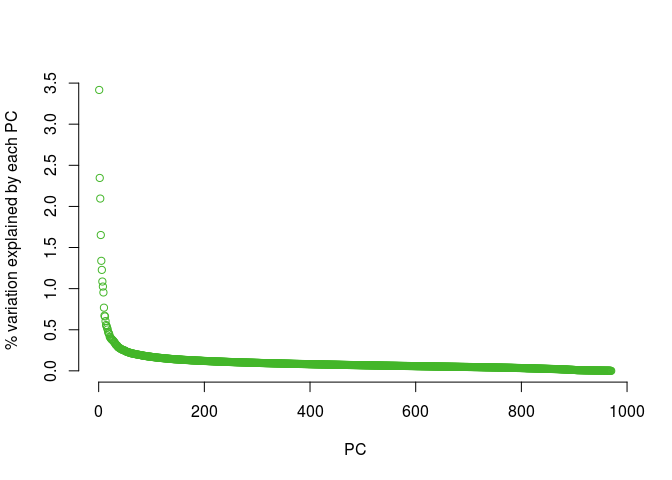
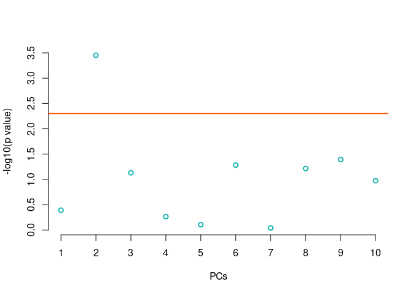
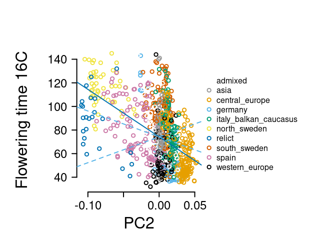
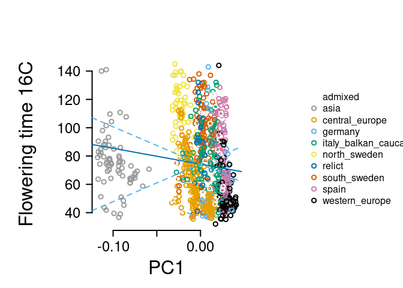

Here is some example code for running Qpc using Arabidopsis flowering time data.


## 1. Load in the data

```r
##read in the data. I have it stored as one combined file with traits and genotypes and other info for all the individuals in my dataset.
load('data/genos-traits-arabidopsis.rda')

#pull out genotypic data
myG = as.matrix(myGadm[, -c(1:17)])

#pull out the trait data
myTraits = myGadm[,1:17]
```


## 2. Make a kinship matrix. 
The input for this is a table of genotypes. You want to randomly sample loci -- I usually use 50,000 SNPs but you may want to use more or less for various reasons. It's a good idea to comapre matrices for a couple different samples to make sure that sampling variance isn't causing a problem. You also want to have no missing data here -- I use a random imputation to replace missing data types. 

```r
## Make the k matrix using the make_k function.
myK = make_k(as.matrix(myG))

## we can look at myK a bit to see how we feel about it.
heatmap(myK, col=inferno(100))
```

<!-- -->

```r
#doing the eigen decomposition
myEig = eigen(myK)

plot(myEig$vectors[,1], myEig$vectors[,2], bty="n", xlab = "PC1", ylab = "PC2", col = lacroix_palette('Mango')[1])
```

<!-- -->

```r
plot(myEig$values/sum(myEig$values)*100, col = lacroix_palette('Mango')[3], bty="n", ylab = "% variation explained by each PC", xlab = "PC")
```

<!-- -->

## 3. Run Qpc. 
In the function:
* myZ is a vector of trait values
* myU is the eigen vectors of the kinship matrix
* myLambdas is the eigen values of th ekinship matrix
* myR is the number of PCs you want to use to estimate Va (these are PCs that correspond to smaller eigenvalues)
* myPCcutoff is the proportion of relatedness variation you want the PCs that you test for selection to explain. So, if you want to look at the PCs that cumulatively explain 20% of relatedness variation, set pcCutoff equal to 0.2

```r
myQpc = calcQpc(myZ = myTraits$FT16_mean, 
                   myU = myEig$vectors, 
                   myLambdas = myEig$values,
                   myR = 200,
                   myPCcutoff = 0.2)
```

## 4. Look at the Qpc output.


First plot out the p values for significance of selection along each PC

```r
plot(-log10(myQpc$pvals), bty="n", xlab = "PCs", ylab = "-log10(p value)", col = lacroix_palette('Mango')[4], lwd=2, xaxt="n")
abline(h = -log10(0.05/length(myQpc$pvals)), col = lacroix_palette('Mango')[1], lwd=2)
axis(1, at = c(1:length(myQpc$pvals)))
```

<!-- -->

Now look at specific PCs. I'm going to color plots by subpopulation but you could do something else. Keep in mind that the confidence intervals are just for plotting because they're based on a linear model for how PCs relate to traits, but the actual test is not linear. 

```r
#estimate the confidence intervals
myVaest = var0(myQpc$cm[600:800])
myCI = 1.96*sqrt(myVaest*myEig$values)

#plot
palette(c('white','#999999', '#E69F00', '#56B4E9', "#009E73", "#F0E442", "#0072B2", "#D55E00", "#CC79A7", 'black', 'mediumpurple3'))
par(mar = c(5,8,5,14), xpd=T)

plot(myEig$vectors[,2], myTraits$FT16_mean[-nrow(myTraits)], bty="n", col = myTraits$group, lwd=2, ylab = "", yaxt="n",xlab = "PC2", cex.lab=2, cex.axis=2, xaxt="n")
axis(1, cex.axis=1.5, lwd=2)
axis(2, las=2, cex.axis=1.5, lwd=2)
mtext('Flowering time 16C',side=2, line=5, cex=2)
legend(0.06, 130, levels(myTraits$group), pch=1, pt.lwd = 2,col = palette(), bty="n", text.width = 0.04)
par(xpd=F)
abline(lm(myTraits$FT16_mean[-nrow(myTraits)]~myEig$vectors[,2]), lwd=2, col = "#0072B2")
abline(a=mean(myTraits$FT16_mean), b = 1.96*myCI[2], lty=2, col='#56B4E9', lwd=2)
abline(a=mean(myTraits$FT16_mean), b = -1.96*myCI[2], lty=2, col='#56B4E9', lwd=2)
```

<!-- -->

```r
par(mar = c(5,8,5,14), xpd=T)
plot(myEig$vectors[,14], myTraits$FT16_mean[-nrow(myTraits)], bty="n", col = myTraits$group, lwd=2, ylab = "", yaxt="n",xlab = "PC14", cex.lab=2, cex.axis=2, xaxt="n")
axis(1, cex.axis=1.5, lwd=2)
axis(2, las=2, cex.axis=1.5, lwd=2)
mtext('Flowering time 16C',side=2, line=5, cex=2)
legend(0.17, 130, levels(myTraits$group), pch=1, pt.lwd = 2,col = palette(), bty="n", text.width = 0.04)
par(xpd=F)
abline(lm(myTraits$FT16_mean[-nrow(myTraits)]~myEig$vectors[,14]), lwd=2, col = "#0072B2")
abline(a=mean(myTraits$FT16_mean), b = 1.96*myCI[14], lty=2, col='#56B4E9', lwd=2)
abline(a=mean(myTraits$FT16_mean), b = -1.96*myCI[14], lty=2, col='#56B4E9', lwd=2)
```

<!-- -->


TODO: environmental cline association analysis.


